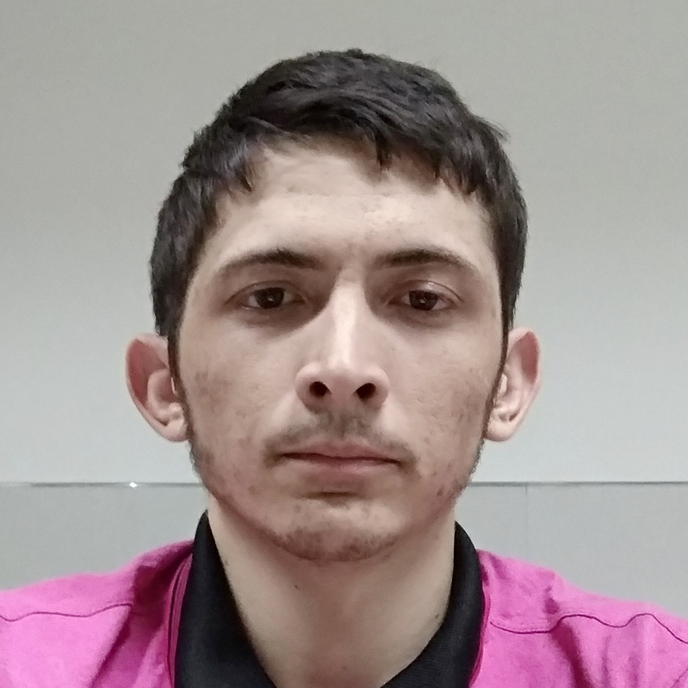
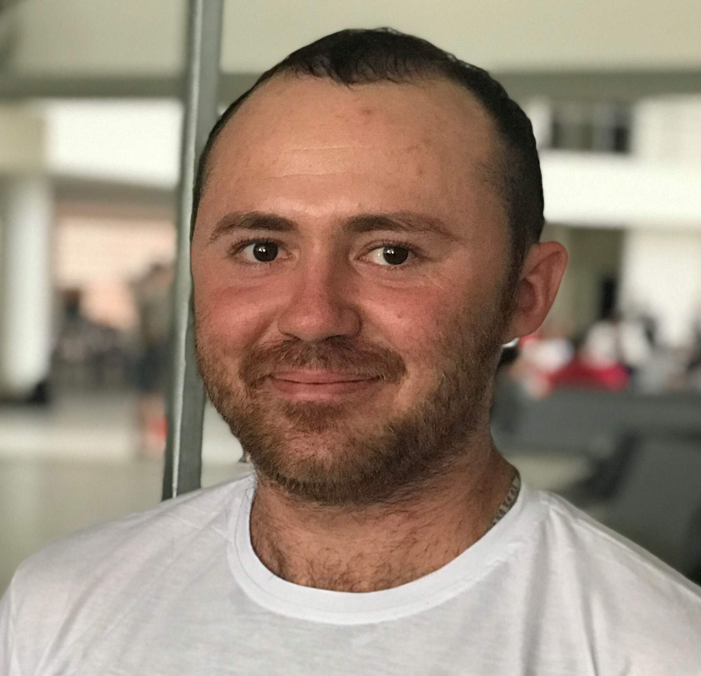
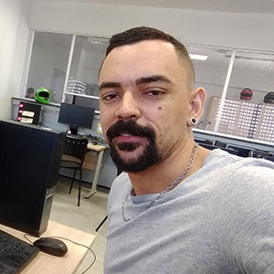

# Graduados em 2019.1

  

    <article class="tile is-child box">
      
João Paulo de Araújo
 (<a href="http://lattes.cnpq.br/7155608920295858">Lattes</a> - <a href="https://www.linkedin.com/in/jo%C3%A3o-paulo-ara%C3%BAjo-99348089/""><i class="fab fa-linkedin"></i></a>)

      <figure class="image is-128x128">
      
      </figure>
      
	

    </article>
  

  

    <article class="tile is-child box">
      
Marcus Vinicius Martins Melo (<a href="http://lattes.cnpq.br/6091624045920112">Lattes</a> - <a href="https://www.linkedin.com/in/vininjr/""><i class="fab fa-linkedin"></i></a>) 

      <figure class="image is-128x128">
      
      </figure>
      

    </article>
  

# Graduados em 2018.2

  

    <article class="tile is-child box">
      
Francisco Antonio Ferreira de Almeida (<a href="http://lattes.cnpq.br/3304199906092593">Lattes</a>)

      <figure class="image is-128x128">
      
      </figure>
      
	

    </article>
  

  

    <article class="tile is-child box">
      
Francisco Uálison Rodrigues de Lima (<a href="http://lattes.cnpq.br/2619316968308833">Lattes</a> - <a href="https://www.linkedin.com/in/ualisonrodrigues/""><i class="fab fa-linkedin"></i></a>) 

      <figure class="image is-128x128">
      
      </figure>
      

    </article>
  

