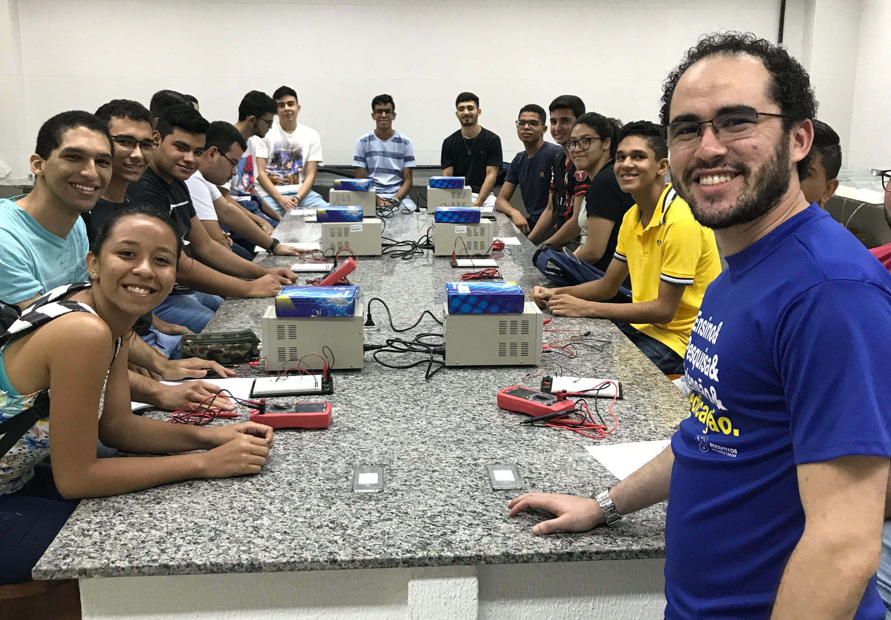

## Objetivo do curso
<!--  -->
O Curso de Bacharelado em Ciência da Computação da UFC em Crateús tem como objetivo formar profissionais aptos a introduzir melhorias e participar efetivamente em empreendimentos de software voltados para os mercados local e global, oferecendo a base teórica suficiente para que os seus egressos possam manter-se constantemente atualizados. Além disso, é objetivo deste curso preparar profissionais para construir, usando as técnicas da Ciência da Computação, sistemas de software corretos e eficientes.

## Áreas de Atuação

O perfil profissional do egresso o capacita a desenvolver as seguintes funções no mercado de trabalho:

  

    <article class="tile is-child box">
      
Coordenador de Equipe

      <figure class="image is-1by1">
      
      </figure>
      
Coordenação de equipes envolvidas em projetos na área de computação e informática	

    </article>
  

  

    <article class="tile is-child box">
      
Consultor

      <figure class="image is-1by1">
      
      </figure>
      
Consultoria e assessoria a empresas de diversas áreas no que tange ao uso adequado de sistemas computacionais	

    </article>
  

  

    <article class="tile is-child box">
      
Membro de Equipe

      <figure class="image is-1by1">
      
      </figure>
      
Participação de forma colaborativa e integrada de equipes que desenvolvem projetos na área de informática	

      

        
Lorem ipsum dolor

      

    </article>
  

  

  

    <article class="tile is-child box">
      
Empreendedor

      <figure class="image is-1by1">
      
      </figure>
      
Descobrimento e empreendimento de novas oportunidades para aplicações usando sistemas computacionais e avaliando a conveniência de se investir no desenvolvimento da aplicação

    </article>
  

  

  

    <article class="tile is-child box">
      
Pesquisador

      <figure class="image is-1by1">
      
      </figure>
      
Participação em projetos de pesquisa científica e tecnológica	

    </article>
  

| Coordenador de Equipe | Consultor | Membro de Equipe | Empreendedor | Pesquisador |
| :-: | :-: | :-: | :-: | :-: |
|  |  |  |  |   |
| Coordenação de equipes envolvidas em projetos na área de computação e informática | Consultoria e assessoria a empresas de diversas áreas no que tange ao uso adequado de sistemas computacionais | Participação de forma colaborativa e integrada de equipes que desenvolvem projetos na área de informática |  Descobrimento e empreendimento de novas oportunidades para aplicações usando sistemas computacionais e avaliando a conveniência de se investir no desenvolvimento da aplicação | Participação em projetos de pesquisa científica e tecnológica |

| Membro de Equipe | Empreendedor | Pesquisador |
| :-: | :-: | :-: |
|  |  |  |   |   |
| Coordenação de equipes envolvidas em projetos na área de computação e informática | Consultoria e assessoria a empresas de diversas áreas no que tange ao uso adequado de sistemas computacionais | Participação de forma colaborativa e integrada de equipes que desenvolvem projetos na área de informática | Descobrimento e empreendimento de novas oportunidades para aplicações usando sistemas computacionais e avaliando a conveniência de se investir no desenvolvimento da aplicação | Participação em projetos de pesquisa científica e tecnológica |

### Coordenador de Equipe

Coordenação de equipes envolvidas em projetos na área de computação e informática

### Consultor

Consultoria e assessoria a empresas de diversas áreas no que tange ao uso adequado de sistemas computacionais

### Membro de Equipe

Participação de forma colaborativa e integrada de equipes que desenvolvem projetos na área de informática

### Empreendedor

Descobrimento e empreendimento de novas oportunidades para aplicações usando sistemas computacionais e avaliando a conveniência de se investir no desenvolvimento da aplicação

### Pesquisador

Participação em projetos de pesquisa científica e tecnológica
