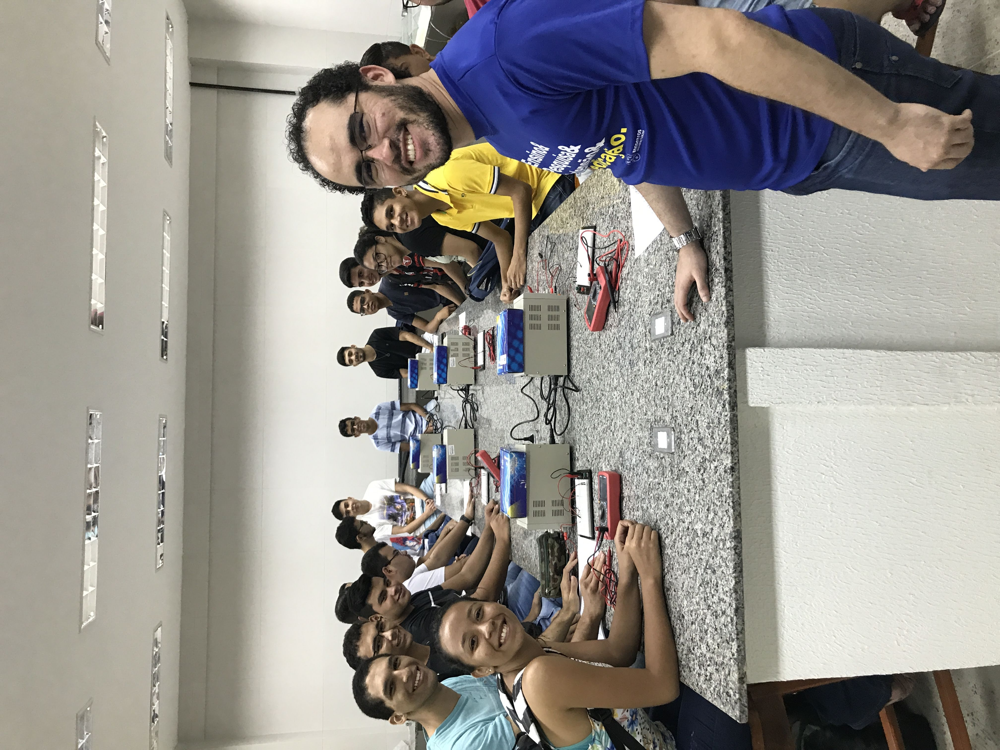

## Objetivo do curso
<!--  -->
O Curso de Bacharelado em Ciência da Computação da UFC em Crateús tem como objetivo formar profissionais aptos a introduzir melhorias e participar efetivamente em empreendimentos de software voltados para os mercados local e global, oferecendo a base teórica suficiente para que os seus egressos possam manter-se constantemente atualizados. Além disso, é objetivo deste curso preparar profissionais para construir, usando as técnicas da Ciência da Computação, sistemas de software corretos e eficientes.

## Áreas de Atuação

O perfil profissional do egresso o capacita a desenvolver as seguintes funções no mercado de trabalho:

  

    <article class="tile is-child box">
      
Coordenador de Equipe

      <figure>
      
      </figure>
      
Coordenação de equipes envolvidas em projetos na área de computação e informática	

    </article>
  

  

    <article class="tile is-child box">
      
Consultor

      <figure>
      
      </figure>
      
Consultoria e assessoria a empresas de diversas áreas no que tange ao uso adequado de sistemas computacionais	

    </article>
  

  

    <article class="tile is-child box">
      
Membro de Equipe

      <figure>
      
      </figure>
      
Participação de forma colaborativa e integrada de equipes que desenvolvem projetos na área de informática	

    </article>
  

  

    <article class="tile is-child box">
      
Empreendedor

      <figure>
      
      </figure>
      
Descobrimento e empreendimento de novas oportunidades para aplicações usando sistemas computacionais e avaliando a conveniência de se investir no desenvolvimento da aplicação

    </article>
  

  

    <article class="tile is-child box">
      
Pesquisador

      <figure>
      
      </figure>
      
Participação em projetos de pesquisa científica e tecnológica	

    </article>
  

